## Notes

### User:

- when provoking the User constructor set the userID automatic based on the number of users in the DataStore
- updateInfo method updates all the userdata all at once (the user presses update Information not update name, update password, update email, etc...)

## General:

- All Constructors will add its object to the DataStore directly
-

```mermaid
---
config:
  theme: dark
  look: neo
---
classDiagram
    direction TB
        class User {
            -role: Role
            -userID: int
            -fName: String
            -lName: String
            -fullName: String
            -phone: String
            -email: String
            -password: String
            -salary: double
            +User(role: Role, id: int, fname: String, lname: String, phone: String, email: String, password: String, salary: double)
            +getRole() String
            +setRole(role: Role) void
            +getId() int
            +getFName() String
            +setFName(fname: String) void
            +getLName() String
            +setLName(lname: String) void
            +getFullName() String
            -setFullName(fullName: String) void
            +getPhone() String
            +setPhone(phone: String) void
            +getEmail() String
            +setEmail(email: String) void
            +getPassword() String
            +setPassword(password: String) void
            +getSalary() double
            +setSalary(salary: double) void
            +updateInfo(fname: String, lname: String, phone: String, email: String, password: String, role: Role, salary: double) void
        }

        class Role {
            <<Enumeration>>
            Admin
            Sales
            Inventory
            Marketing
        }

        %% User ..> Role : uses
        Role <.. User : uses


        class Admin {

            +Admin(role: Role, id: int, fname: String, lname: String, phone: String, email: String, password: String, salary: double)
            +addUser(role: Role, id: int, fname: String, lname: String, phone: String, email: String, password: String, salary: double) void
            +updateUser(id: int, user: User) void
            +deleteUser(id: int) void
        }

        class Inventory {
            -products: List<Product>
            -damageLogs: List<DamageLog>
            -returnLogs: List<DamageLog>
            -notifications: List<Notification>
            +Inventory(id: int, fname: String, lname: String, phone: String, email: String, password: String, role: Role, salary: double)
            +addProduct(p: Product) : void
            +updateProduct(id: String, p: Product) : void
            +deleteProduct(id: String) : void
            +listProducts() : List
            +searchProduct(keyword: String) : List
            +addDamageLog(log: DamageLog) : void
            +listDamageLogs() : List
            +addReturnLog(log: DamageLog) : void
            +listReturnLogs() : List
            +checkLowStock() : List
            +checkExpiryDates() : List
            +viewNotifications() : List
        }

        class Product {
            -productID: int
            -name: String
            -description: String
            -category: String
            -brand: String
            -size: String
            -price: double
            -threshold: int
            -batches: ArrayList~Batch~
            -offer: Offer
            +Product(name: String, description: String, category: String, price: double, threshold: int)
            +isOffer() boolean
            +getOffer() Offer
            +setOffer() void
            +removeOffer() void
            +getTotalQuantity() int
            +addStock(qty: int, date: Date) void
            +reduceStock(qty: int) boolean
            +isLowStock() boolean
            +getNextExpiryDate() Date
            +isNearExpiry() boolean
        }

        %% class Size {
        %%     <<Enumeration>>
        %%     SMALL
        %%     MEDIUM
        %%     LARGE
        %% }

        class Batch {
            -batchID: int
            -deliveryDate: Date
            -expiryDate: Date
            -quantity: int
            +Batch(expiryDate: Date, quantity: int)
            +getQuantity() int
            +setQuantity(quantity: int) void
        }

        class Order {
            -orderID: int
            -date: Date
            -totalQuantity: int
            -totalPrice: double
            -seller: Sales
            %% -status: OrderStatus
            -items: ArrayList~OrderItem~
            +Order(seller: Sales)
            +addItem(product: Product, quantity: int) void
            +deleteItem(item: OrderItem) void
            +calculateTotalPrice() double
            +calculateTotalQuantity() int
            +getOrderID() int
            +getDate() Date
            +getSeller() Seller
            +getTotalQuantity() int
            %% +getTotalPrice()
            %% +setStatus(status: OrderStatus) void
        }

        %% class Cart {
        %%     -orderItems: ArrayList~OrderItem~
        %%     +addItem() void
        %% }


        class OrderItem {
            -product: Product
            -quantity: int
            -priceThatDate: double
            +OrderItem(product: Product, quantity: int)
            +getSubTotal() double
            +getProduct() Product
            +getQuantity() int
            +setQuantity(quantity: int) void
        }

        %% class OrderStatus {
        %%     <<Enumeration>>
        %%     PENDING
        %%     COMPLETED
        %%     CANCELLED
        %% }

        %% Order ..> OrderStatus : uses

        class Notification {
            -message: String
            -dateCreated: Date
            -type: String
        }

        class Offer {
            -description: String
            -startDate : Date
            -endDate : Date
            -discount : double
            +isValid() boolean
            +showOffer() void
        }

        class Report {
            -author: Marketing
            -date : Date
            -type : String
            -content : String
            +generateReportSummary() String
        }

        class DamageLog {
            -logID: String
            -reason: String
            -qtyLost: int
            -productId:string
            +getLogId() :string
            +getReason() :string
            +getQtyLost() :int
            +getProductId() :string
            +setQtyLost(int) :void
            +setReason(string) :void
        }

        class DataStore {
            -users: ArrayList~User~
            -products: ArrayList~Product~
            -orders: ArrayList~Order~
            -notifications: ArrayList~Notification~
            -offers: ArrayList~Offer~
            -damageLogs: ArrayList~DamageLog~
            +getInstance() DataStore
            +loadAllData() void
            +saveAllData() void
            +getUsers() ArrayList~User~
            +getProducts() ArrayList~Product~
            +getOrders() ArrayList~Order~
            +getNotifications() ArrayList~Notification~
            +getOffers() ArrayList~Offer~
            +getDamageLogs() ArrayList~DamageLog~
            +search(name: String, type: String) ArrayList~Object~
        }

        class FileManager {
            +readFile(filename: String) ArrayList~String[]~
            +writeFile(filename: String, list: ArrayList~Object~) void
            +appendLine(filename: String, obj: Object) void
        }

        class Session {
            -instance:session
            -currentUser: User
            +getInstance() Session
            +getUser() User
            +setUser(user: User) void
            +logout() void
        }



        %% class Employee {
        %%     +Employee(role: Role, id: int, fname: String, lname: String, phone: String, email: String, password: String, salary: double)
        %%     %% +getRole() String
        %%     %% +setRole(role: Role) void
        %% }

        class Sales {
            +Sales(id: int, fname: String, lname: String, phone: String, email: String, password: String, salary: double)
            +makeOrder() void
            +cancelOrder(id: String) void
        }

        class Marketing {
            -offers: List
            +Marketing(id: int, fname: String, lname: String, phone: String, email: String, password: String, role: Role, salary: double)
            +makeReport() void
            +createOffer(offer: Offer) void
            +analyzeSalesData() void
            +getTopSellingProducts() List
        }

        class Auth {
            -dataStore:DataStore
            -session:Session
            +authenticate(username: String, password: String) User
            +logout() :void
            +changePassword(userID:String,oldPass:String:newPass:string) :boolean
            +changeUsername(userID:stirng,newUsername:string) :boolean
            +validateRole(RequiredRole:string) :boolean
            isloggedIn() :boolean
        }

        <<Singleton>> DataStore
        <<Utility>> FileManager
        <<Singleton>> Session

        note for User "- Set the user ID manually
        - updateInfo changes all user attributes at once"

        User <|-- Sales
        User <|-- Marketing
        User <|-- Inventory
        User <|-- Admin
        %% User <|-- Employee
        %% Employee <|-- Sales
        %% Employee <|-- Inventory
        %% Employee <|-- Marketing
        %% Admin "1" --> "0..*" Employee : manages
        Order "1" *-- "1..*" OrderItem : contains
        OrderItem --> Product : references
        Admin ..> DataStore : accesses

        Inventory ..> DataStore : accesses
        Marketing ..> DataStore : accesses
        DataStore ..> FileManager : uses
        Sales ..> Order : creates
        Sales ..> DataStore : accesses
        Auth ..> DataStore : queries
        Auth ..> Session : initializes
        Inventory ..> DamageLog : creates
        Marketing ..> Offer : creates
        Offer --> Product : applies to
        Marketing ..> Report : creates
        Product "1" *-- "0..*" Batch : contains
```

